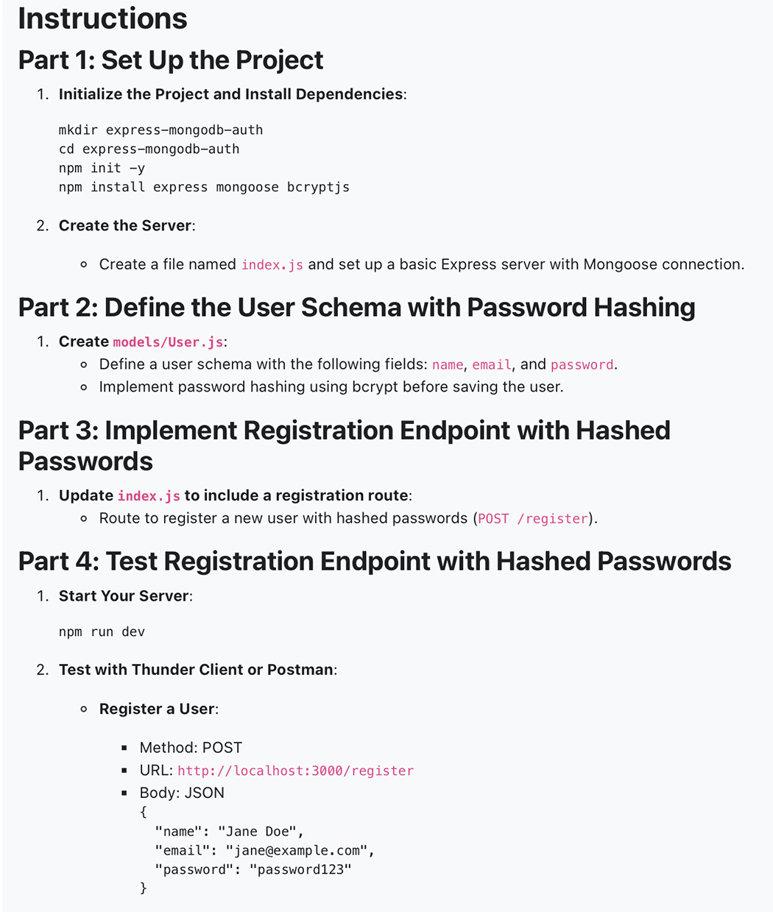
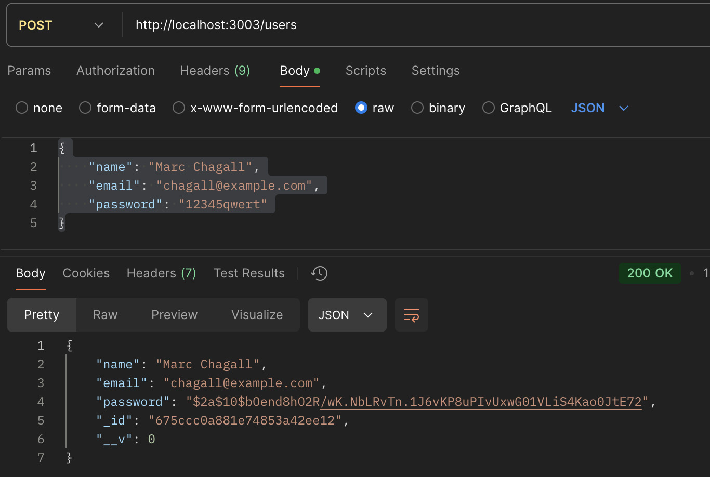
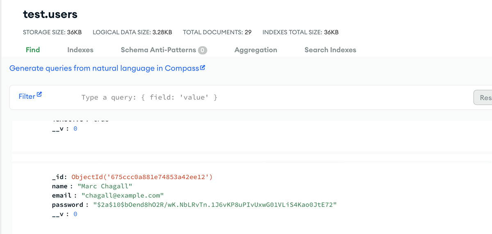
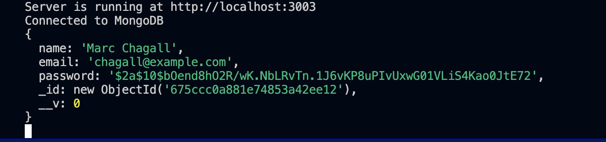

## **Express-Mongodb-Auth**

## **Objective**
- Understand the basics of authentication.
- Store user passwords securely using hashing.
- Implement user registration with password hashing.

- Check the Database:

- [x] Connect to your MongoDB database and check the users collection. You should see the user's password stored as a hashed value.
- [x] Take a Screenshot:

Screenshot of the POST request to register a user with hashed passwords.

## **Conclusion**
- This project demonstrates how to build a robust authentication system with Express.js and MongoDB. With this setup, you're ready to expand the project by adding features such as login functionality, token-based authentication, or user management. It's a great starting point for building secure web applications.
